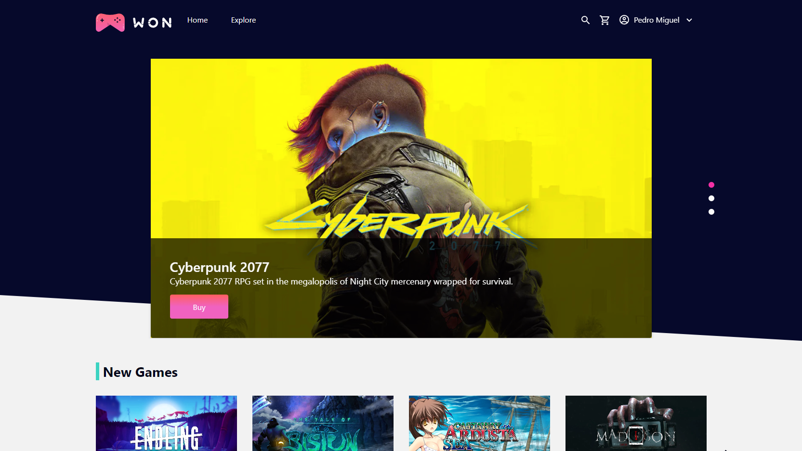

<h1 align="center">
    
</h1>

<p align="center">
  <a href="#-tecnologias">Tecnologias</a>&nbsp;&nbsp;&nbsp;|&nbsp;&nbsp;&nbsp;
  <a href="#-comandos">Comandos</a>&nbsp;&nbsp;&nbsp;|&nbsp;&nbsp;&nbsp;
  <a href="#-como-executar-o-projeto">Pré-requisitos</a>&nbsp;&nbsp;&nbsp;|&nbsp;&nbsp;&nbsp;
</p>

<p align="center">
  

  

  <a href="https://github.com/pedromiiguel/won-games-client/commits/master">
    
  </a>

   <a href="https://github.com/pedromiiguel/won-games-client/stargazers">
    
  </a>
</p>

<br/>

<h1 align="center">
     
</h1>

## 🚀 Tecnologias

Tecnologias utilizazadas no projeto:

- [TypeScript](https://www.typescriptlang.org/)
- [NextJS](https://nextjs.org/)
- [Styled Components](https://styled-components.com/)
- [Jest](https://jestjs.io/)
- [React Testing Library](https://testing-library.com/docs/react-testing-library/intro)
- [Storybook](https://storybook.js.org/)
- [Eslint](https://eslint.org/)
- [Prettier](https://prettier.io/)
- [Husky](https://github.com/typicode/husky)
- [Cypress](https://www.cypress.io/)

## Comandos

- `dev`: Rodar a aplicação em `localhost:3000`
- `build`: cria a versão de compilação de produção
- `start`: Rodar a aplicação com o código de produção
- `lint`: executa o linter em todos os componentes e páginas
- `test`: executa jest para testar todos os componentes e páginas
- `test:watch`: executa jest no modo de watch
- `storybook`: roda storybook em `localhost:6006`
- `build-storybook`: cria a versão de compilação do livro de histórias

## 🔧 Como executar o projeto

### Pré-requisitos

<p> É necessário possuir o Node.js instalado na máquina </p>
<p>E também possuir um gerenciador de tarefas NPM ou Yarn.</p>

```bash
# Clone este repositório
$ git clone https://github.com/pedromiiguel/won-games-client.git

# Acesse a pasta do projeto no terminal/cmd
$ cd won-games-client

# Instale as dependências
$ npm install ou yarn

# Execute a aplicação em modo de desenvolvimento
$ npm dev ou yarn dev

# O servidor inciará na porta:3000 - acesse http://localhost:3000
```

## :man_astronaut: Autor

#### Pedro Miguel

- Git Hub: <a href="https://github.com/pedromiiguel" target="_blank" >@pedromiiguel</a>
- Linkedin: <a href="https://www.linkedin.com/in/pedro-miiguel" target="_blank" >@pedromiiguel</a>
